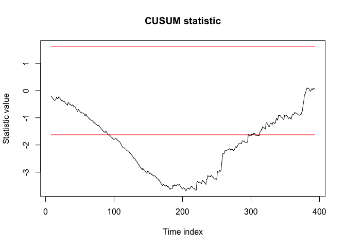
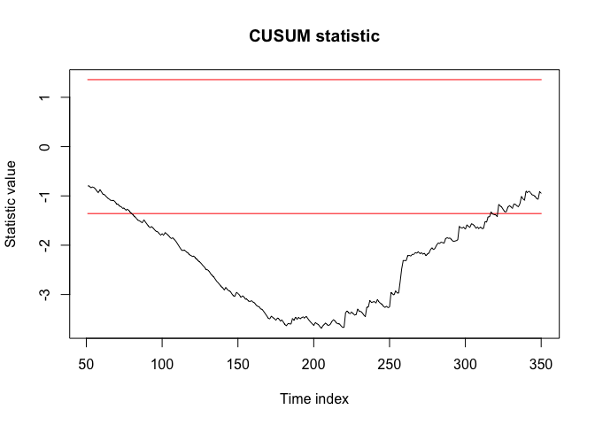

<!-- README.md is generated from README.Rmd. Please edit that file -->
VARCP
=====

``` r
# install.packages("devtools")
#devtools::install_github("MasimovR/VARCP")
```

Example
-------

This is a basic example which shows you how to solve a common problem:

``` r
library(VARCP)
#> Loading required package: MTS

phi <- matrix(c(0.2,-0.6,0.3,1),2,2)
sig <- matrix(c(4,0.8,0.8,1),2,2)
m1=VARMAsim(200, arlags = 1, phi=phi, sigma=sig)
m2=VARMAsim(200, arlags = 1, phi=phi, sigma=sig*2)
m <- rbind(m1$series, m2$series)  
model <- VAR(m, p = 1)
#> Constant term: 
#> Estimates:  -0.01087932 0.007462765 
#> Std.Error:  0.120823 0.06183162 
#> AR coefficient matrix 
#> AR( 1 )-matrix 
#>        [,1]  [,2]
#> [1,]  0.201 0.287
#> [2,] -0.641 1.024
#> standard error 
#>        [,1]   [,2]
#> [1,] 0.0484 0.0385
#> [2,] 0.0248 0.0197
#>   
#> Residuals cov-mtx: 
#>          [,1]     [,2]
#> [1,] 5.777643 1.318246
#> [2,] 1.318246 1.513118
#>   
#> det(SSE) =  7.004485 
#> AIC =  1.966551 
#> BIC =  2.006465 
#> HQ  =  1.982357
```

``` r
CUSUM <- statcomp(model, type = "CUSUM")
str(CUSUM)
#> List of 2
#>  $ values: Named num [1:386] 0.00488 -0.0395 -0.06952 -0.04279 -0.08888 ...
#>   ..- attr(*, "names")= chr [1:386] "8" "9" "10" "11" ...
#>  $ type  : chr "CUSUM"
#>  - attr(*, "class")= chr "VARCD"
```

``` r
plot(CUSUM, a = 0.01)
```



``` r
changetest(CUSUM)
#> 
#>  CUSUM test
#> 
#> data:  CUSUM
#> Estimated change point = 233, p-value = 1.111e-09
#> sample estimates:
#>   C(h) 
#> 3.2643
```

``` r
CUSUM2 <- statcomp(model, type = "CUSUM", trim = 50)
plot(CUSUM2)
```



``` r
LRT <- statcomp(model, type = "LRT")
DET <- statcomp(model, type = "DARLING-ERDOS")
```
